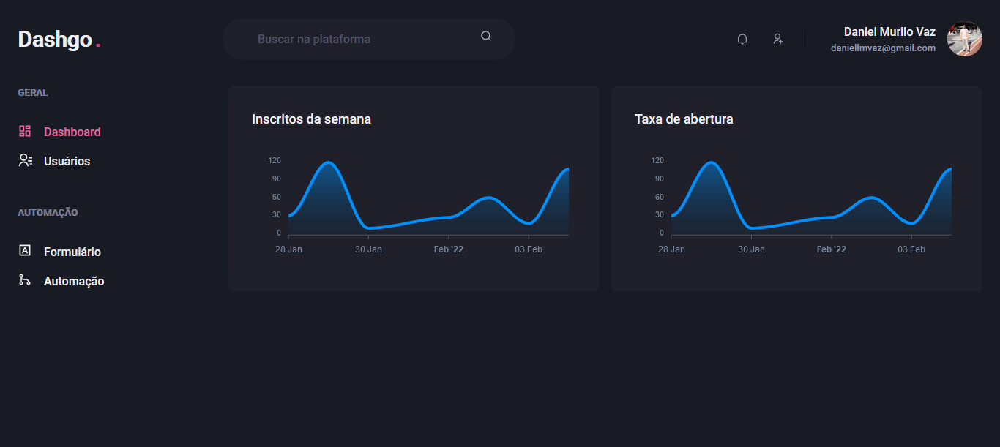

<h1 align="center" style="font-weight: bold; margin-bottom: 2rem">
  Dashgo <span style="color: #D53F8C">.</span>
</h1>
<p align="center">
  
  <a href="https://twitter.com/daniellmurilo" target="_blank">
    
  </a>
  <a href="https://twitter.com/daniellmurilo" target="_blank">
    
  </a>
</p>
<h2 align="center" style="margin-top: 2rem; margin-bottom: 2rem">
  Sistema desenvolvido no capítulo IX da trilha de React <br>
  do Ignite da Rocketseat. 
</h2>



#

<nav>
  <ul style="display: flex; flex-direction: column; margin-top: 1rem">
    <ui><a href="#usage" style="font-weight: bold; color: #e2e2e2">Como usar</a></ui>
    <ui><a href="#concepts" style="font-weight: bold; color: #e2e2e2">Conceitos</a></ui>
    <ui><a href="#languages" style="font-weight: bold; color: #e2e2e2">Linguagens usadas</a></ui>
  </ul>
</nav>

#

<div id="usage">
  <h2>Como usar</h2>
</div>

### Clone esse repositório em uma pasta de sua preferência:

```
 git clone https://github.com/daniellvaz/dashgo.git
```

### Instale as dependências:

```
 yarn install
```

#### ou

```
 npm install
```

### Inicie o servidor com o comando:

```
 yarn dev npm run dev
```

#### ou

```
 npm run dev
```

### Por fim acessa o localhost no seu browser na porta 3000 😀

#

<div id="concepts">
  <h2>Conceitos aprendidos</h2>
</div>

- Construção de interfaces com estilização declarativa
- Manipulação de elementos de forma declarativa e imperativa
- Utilização do react hook form
- Utilização do Yup em validação de Usuários

#

<div id="langages">
  <h2>Linguagens utiliazdas</h2>
</div>
<p style="margin-top: 2rem">
  
</p>
